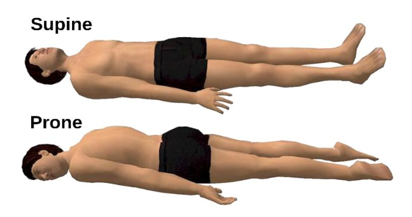
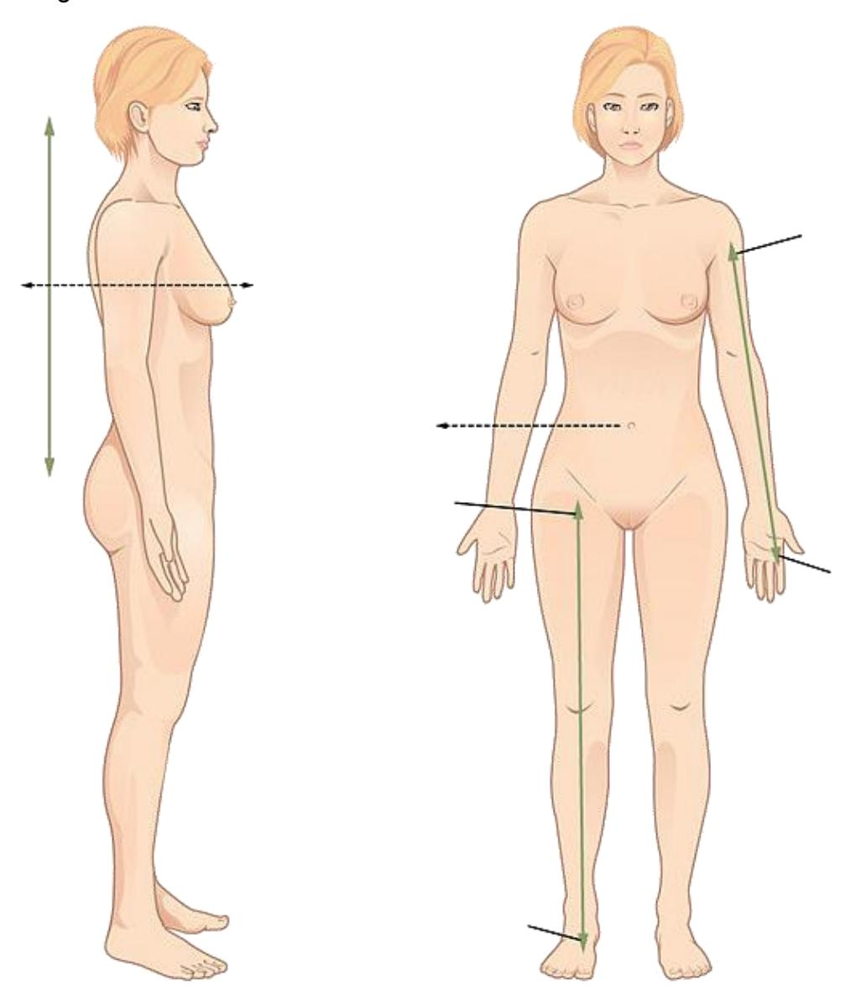
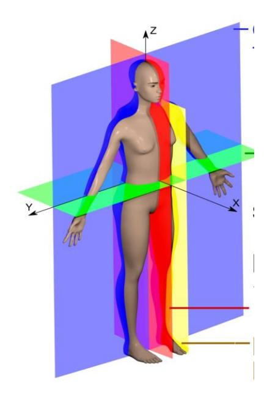
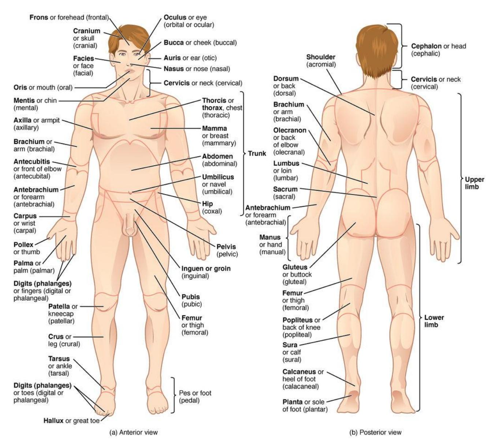
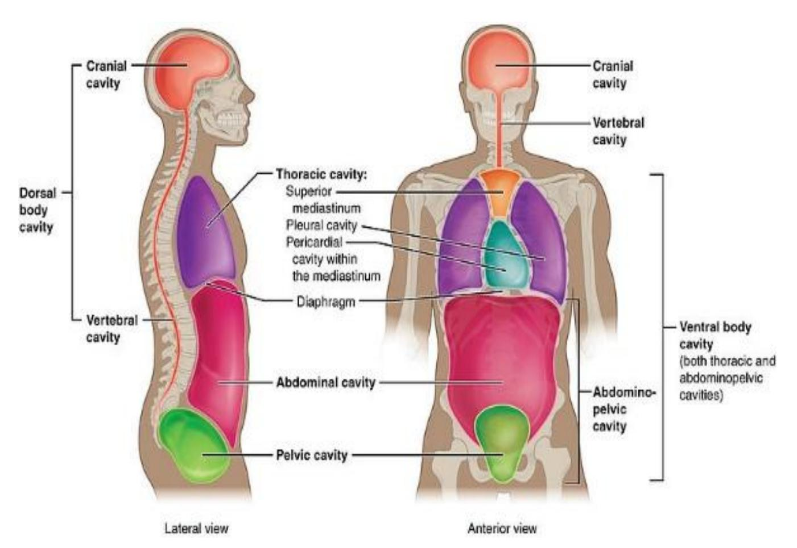
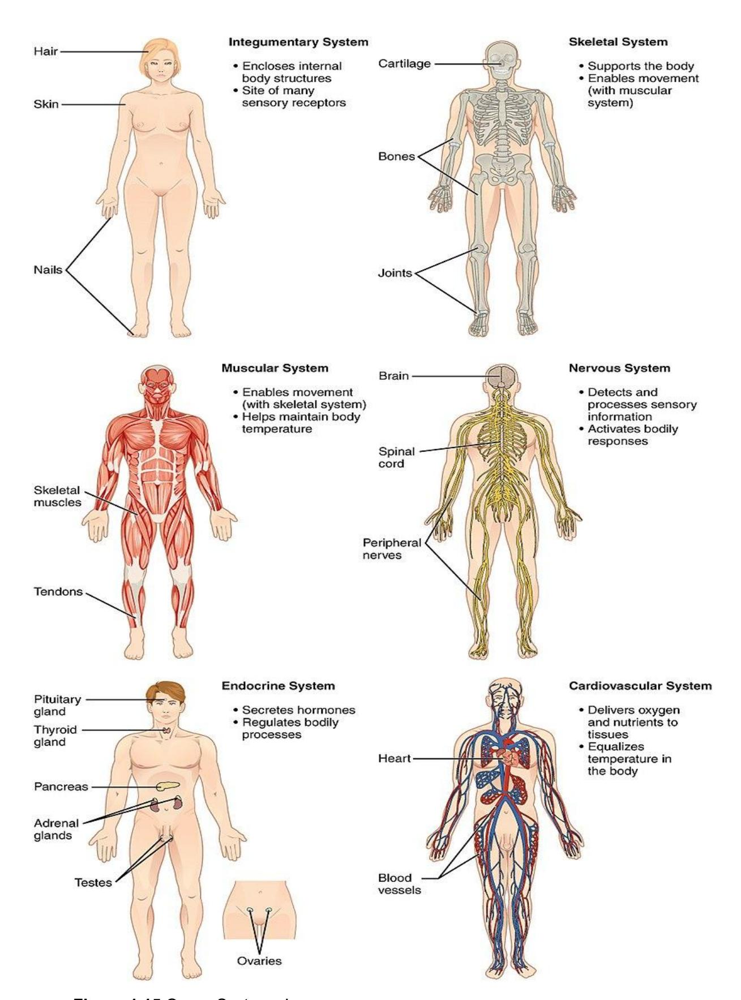
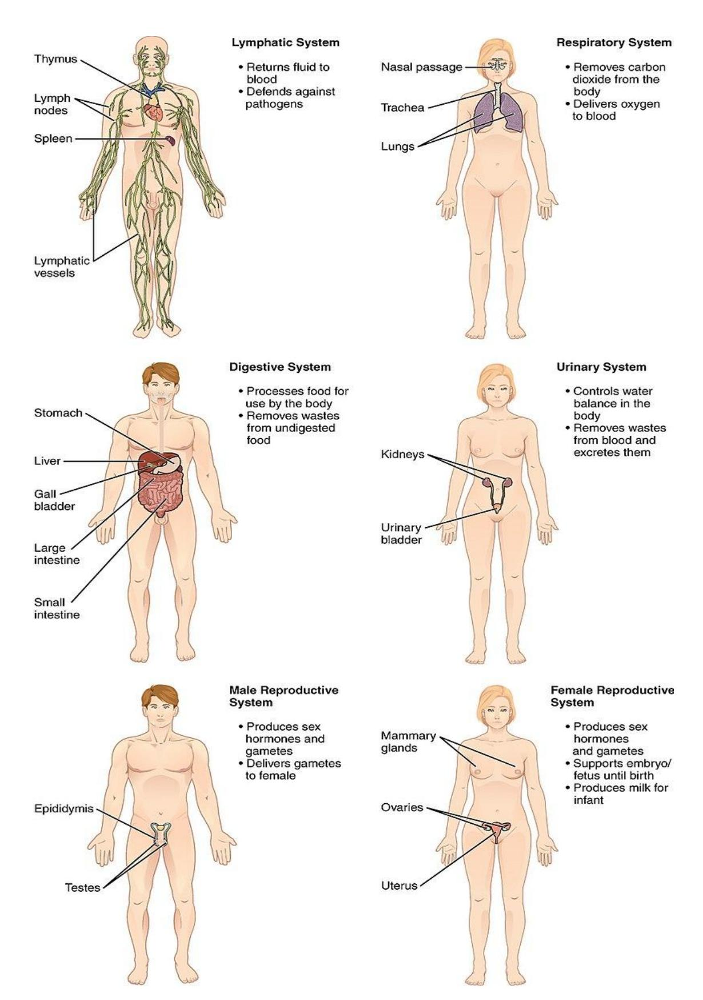

# **Anatomical Language**

## **Your objectives for this lab are to:**

-   Define and demonstrate the anatomical position.
-   Use the correct terminology to describe the planes of the body.
-   Identify the planes of view is several different views of the body.
-   Define and demonstrate the different anatomical positions.
-   Define and demonstrate the directional terms used in anatomy.
-   Define and apply the different anatomical regions.
-   Locate the major cavities and describe several of the organs that lie within each.
-   Identify the abdominopelvic cavities':
    -   Four quadrants and their organs
    -   Nine regions and their organs
-   Identify the serous membranes within the body and their respective layers.

## **Terms to learn:**

## **Regional Terms**

## **Anterior View**

-   Abdominal
-   Antebrachial
-   Antecubital
-   Axillary
-   Brachial
-   Buccal
-   Carpal
-   Cervical
-   Thoracic
-   Crural
-   Deltoid
-   Digital
-   Femoral
-   Frontal
-   Inguinal
-   Nasal
-   Oral
-   Orbital
-   Palmar
-   Patellar
-   Pectoral
-   Pedal
-   Pelvic
-   Pubic
-   Sternal
-   Tarsal

### **Posterior View**

-   Calcaneal
-   Cephalic
-   Gluteal
-   Lumbar
-   Occipital
-   Plantar
-   Sacral
-   Vertebral

## **Directional Terms**

-   Superior (cranial, cephalic)
-   Inferior (caudal)
-   Anterior (ventral)
-   Posterior (dorsal)
-   Medial
-   Lateral
-   Proximal
-   Distal
-   Intermediate
-   Superficial (external)
-   Deep (internal)

## **Planes**

-   Sagittal
-   Midsagittal
-   Parasagittal
-   Frontal (coronal)
-   Transverse (horizontal)
-   Oblique section
-   Cross-section vs. Longitudinal section

## **Body Cavities, Membranes, and Abdominopelvic Quadrants**

Be able to identify cavities, as well as organs found in each cavity.

## **Cavities**

-   Dorsal cavity
    -   Cranial cavity
    -   Spinal cavity
-   Ventral cavity
    -   Thoracic cavity
        -   Pleural cavities
        -   Pericardial cavity
        -   Mediastinum
    -   Abdominopelvic cavity
        -   Abdominal cavity
        -   Pelvic cavity

## **Abdominopelvic Quadrants – identify organs within each quadrant.**

-   Right upper quadrant
-   Left upper quadrant
-   Right lower quadrant
-   Left lower quadrant

## **Organ Systems**

**Know what organs are in each system, as well as the general functions of the system.**

-   Integumentary
-   Skeletal
-   Muscular
-   Nervous
-   Endocrine
-   Cardiovascular
-   Lymphatic
-   Respiratory
-   Digestive
-   Urinary
-   Reproductive

## **Prelab Activities**

## **Prelab Activity 1.1**

Definitions: define the terms that are essential to this chapter.

### Directional terms

+| Term                  | Definition                                     |
| --------------------- | ---------------------------------------------- |
| Anterior (or ventral) | Toward the front of the body                   |
| Posterior (or dorsal) | Toward the back of the body                    |
| Superior (or cranial) | Toward the head or upper part of a structure   |
| Inferior (or caudal)  | Toward the feet or lower part of a structure   |
| Lateral               | Away from the midline of the body              |
| Medial                | Toward the midline of the body                 |
| Proximal              | Closer to the point of attachment or origin    |
| Distal                | Farther from the point of attachment or origin |
| Superficial           | Toward or at the body surface                  |
| Deep                  | Away from the body surface; more internal      |

### Body Cavities

| Term        | Definition                                                              |
| ----------- | ----------------------------------------------------------------------- |
| Cranial     | Cavity within the skull that contains the brain                         |
| Abdominal   | Cavity containing digestive organs such as stomach and intestines       |
| Pericardial | Cavity surrounding the heart                                            |
| Pleural     | Cavities surrounding each lung                                          |
| Ventral     | Anterior body cavity that includes thoracic and abdominopelvic cavities |

### Body Planes

| Term               | Definition                                            |
| ------------------ | ----------------------------------------------------- |
| Sagittal plane     | Divides the body into left and right portions         |
| Midsagittal plane  | Divides the body into equal left and right halves     |
| Parasagittal plane | Divides the body into unequal left and right portions |
| Frontal plane      | Divides the body into anterior and posterior portions |
| Transverse plane   | Divides the body into superior and inferior portions  |
| Oblique plane      | Divides the body at an angle                          |

## **Prelab Activity 1.2**

## **Identification**

Identify the following cavities or structures in the body.

**Figure 1.1** Diagram of labeled body cavities.

**Table 1.1 Identification Table for Figure 1.1.**

+---------------+-------------------------------------------------------+
| Cavity number | Cavity or structures                                  |
+===============+=======================================================+
| 1             |        cranial                                         |
+---------------+-------------------------------------------------------+
| 2             |         thoracic                                      |
+---------------+-------------------------------------------------------+
| 3             |          abdominal                                      |
+---------------+-------------------------------------------------------+
| 4             |         pelvic                                      |
+---------------+-------------------------------------------------------+
| 5             |        ventral                                               |
+---------------+-------------------------------------------------------+
| 6             |        abdominopelvic                                                |
+---------------+-------------------------------------------------------+
| 7             |        dorsal                                               |
+---------------+-------------------------------------------------------+
| a             |        plueral                                                |
+---------------+-------------------------------------------------------+
| b             |        vertebral                                               |
+---------------+-------------------------------------------------------+
| c             |        mediastinum                                               |
+---------------+-------------------------------------------------------+
| d             |        pericardial                                               |
+---------------+-------------------------------------------------------+
| e             |         diaphram                                              |
+---------------+-------------------------------------------------------+

## **Prelab Activity 1.3**

## **Identification**

Using the lab manual or your textbook, list the 12 organ systems of the body below and the major functions and organs in each: (Note: Male and female reproductive systems are counted as two systems, 11a and 11b, respectively).

**Table 1.2**. Identification of Organs and their Function
| #   | Organ System        | Function                                   | Organs                             |
| --- | ------------------- | ------------------------------------------ | ---------------------------------- |
| 1   | Integumentary       | Protection, temperature regulation         | Skin, hair, nails                  |
| 2   | Skeletal            | Support, protection, blood cell production | Bones, cartilage                   |
| 3   | Muscular            | Movement, heat production                  | Skeletal muscles                   |
| 4   | Nervous             | Control, rapid communication               | Brain, spinal cord, nerves         |
| 5   | Endocrine           | Hormone regulation                         | Pituitary, thyroid, adrenal glands |
| 6   | Cardiovascular      | Transport of blood, nutrients              | Heart, blood vessels               |
| 7   | Lymphatic           | Immunity, fluid balance                    | Lymph nodes, vessels, spleen       |
| 8   | Respiratory         | Gas exchange                               | Lungs, trachea                     |
| 9   | Digestive           | Breakdown and absorption of food           | Stomach, intestines, liver         |
| 10  | Urinary             | Waste removal, fluid balance               | Kidneys, bladder                   |
| 11a | Male Reproductive   | Produce sperm, hormones                    | Testes, penis                      |
| 11b | Female Reproductive | Produce eggs, support fetus                | Ovaries, uterus                    |

## **Lab Activities**

## **Lab Activity 1.1**

## **Body Organization and Terminology Review**

**Anatomical Terminology**: Using the information in your textbook define the following anatomical terms:

### **Anatomical position**

**Figure 1.2**. Anatomical position.

#### **Prone and supine positions**

**Figure 1.3** Prone and supine diagrams.

## **Lab Activity 1.2**

## **Applying Directional Terms**; label the diagrams below:

## **List of directional terms**

-   Right
-   Left
-   superior
-   inferior
-   anterior
-   posterior
-   dorsal
-   ventral
-   cranial
-   caudal
-   medial
-   lateral
-   proximal
-   distal
-   superficial
-   deep

In the image below label the directional terms that are listed above

**Figure 1.4** Unlabeled directional terms diagram.

Indicate in the boxes provided the deep and superficial positions.

**Figure 1.5** Sagittal section of the head. The subject is an 18-year-old male who had blunt trauma to the head after a 25 m long jump during [motocross.](https://en.wikipedia.org/wiki/Motocross)

## **Lab Activity 1.3**

## **Labeling Anatomical and Regional Terminology**

-   Obtain labeling tape and one of the models or skeletons (e.g., a torso model, mini muscle person torso, skeleton)
-   Write the directional terms from activity 1.2 on the model.
-   Once you are done, have another group check your accuracy. Make corrections if needed.
-   Then, have your instructor or Lab Instructor check your accuracy.
-   Take pictures of your work to use as a study guide.

## **Lab Activity 1.4**

## **Applying Anatomical and Regional Terminology**

Use appropriate anatomical and regional terminology to fill in the blanks in the statements below.
The elbow is located proximal to the wrist.
The umbilicus is located inferior to the sternum.
The nose is located medial to the ears.
The mouth is located superior to the chin.
A papercut that does not penetrate the skin would be considered a superficial wound; however, a puncture wound from a nail penetrating the skin would be considered a deep wound.
A wound on the elbow would be distal to the shoulder.

## **Lab Activity 1.5**

## **Applying Anatomical and Regional Terminology**

Next, using the definition of anatomical position and correct anatomical language, take turns with your lab partner to give simple, one-movement verbal instructions to transition from the given starting positions (listed in the table below), so that the other person ends up in anatomical position. Write your detailed step-by-step instructions on the provided table.

---------------------------------------+
|| Starting Position | Image | Instructions Given to Move to Anatomical Position |
|---|---|---|
| **Example:** Standing from a Half Spinal Twist with the feet placed to the left, the torso twisted away from you and the head facing at a slight angle to the right |  | **Example:** - Rotate the mental (chin) region anteriorly and medially. - Rotate the trunk and lower body 180 degrees to the left until facing anteriorly. - Supinate the forearms so the palmar regions face anteriorly. |
| **1:** From lying face‑up on the ground with the head, back, hands, and feet on the floor and both knees bent |  | - Extend both knees to straighten the lower limbs. - Flex the trunk to move from a supine to an upright seated position. - Extend the hips and knees to stand upright. - Place both feet flat on the floor pointing anteriorly. - Position the upper limbs at the lateral sides of the body. - Supinate the forearms so the palms face anteriorly. - Align the head so the face and eyes face anteriorly. |
| **2:** From a seated position on the floor with the legs straight and arms folded across the chest |  | - Extend the hips and knees to move from a seated to a standing position. - Position both feet flat on the floor facing anteriorly. - Extend the upper limbs downward to the lateral sides of the torso. - Extend the elbows fully. - Supinate the forearms so the palms face anteriorly. - Adjust the head so the face and eyes look anteriorly. |

## **Lab Activity 1.6**

## **Sectioning/Body Planes**

Using your text, label the planes in the figure below. Draw an oblique plane in the brachial area of the right arm.

## **Body Planes**

-   Sagittal plane
-   Midsagittal plane
-   Parasagittal plane
-   Transverse plane
-   Coronal plane
-   Oblique plane

**Figure 1.9**. Human Anatomical Planes.

Indicate what type of planes were used in the following demonstrations:

**Figure 1.10** Human Head slice.

Plane:

**Figure 1.11** An anatomical illustration from Sobotta's Human Anatomy 1908.

Plane:

## **Lab Activity 1.7**

## **Regional Terminology**

-   Obtain tape and any of the following models (a torso model, mini muscle person torso, skeleton)
-   Write the following terms and attach them to your models.

## **Regions of the body,**

## **Axial Region:**

-   **Cephalic (head)**
    -   Cranial
    -   Pectoral
    -   Facial
    -   Frontal forehead
    -   Orbital eye
    -   Nasal nose
    -   Buccal cheek
    -   Oral mouth
    -   Mental chin
    -   Cervical/Nuchal neck

## **Appendicular:**

-   **Upper Extremity**
    -   Axillary armpit
    -   Brachial arm
    -   Cubital elbow
    -   Antebrachial forearm
    -   Carpal wrist
    -   Manual hand
    -   Digital finger

## **Trunk**

-   Thoracic chest
-   Sternal Clavicular
-   Acromial shoulder
-   Abdominal belly
-   Inguinal groin
-   Pubic genital
-   Coxal hip
-   Vertebral Vertebral column
-   Lumbar lower back
-   Sacral
-   Gluteal (buttocks)

## **Lower Extremity**

-   Femoral thigh
-   Popliteal back of knee
-   Patellar kneecap
-   Crural leg
-   Calcaneal heel
-   Tarsal ankle
-   Pedal foot

**Figure 1.12** The human body is shown in an anatomical position in an (a) anterior view and a (b) posterior view. The regions of the body are labeled in bold face.

## **Body Cavities and Associated Serous Membranes**

-   **Dorsal Cavity:**
    -   Cranial cavity
    -   Vertebral cavity

## **Ventral Cavity:**

-   Thoracic cavity
    -   Mediastinum
    -   Pleural cavities
    -   Pericardial cavity
    -   Diaphragm
-   Abdominopelvic cavity
    -   Abdominal cavity
    -   Pelvic cavity

## **Body Cavities and Associated Serous Membranes Continued**

## **Viscera:**

Ventral body cavities contain **membranes** = soft, thin, pliable layer of tissue:

-   **Visceral Membranes** cover the organs
-   **Parietal Membranes** line the body cavity
    -   There is a space between a visceral and parietal membrane, the **serous cavity**, into which **serous fluid** is secreted for **lubrication**.
-   Cavities referenced to the membranes.
    -   Pleura
    -   Pericardial
    -   Peritoneum

**Figure 1.13** Labeled body cavities.

## **Lab Activity 1.7**

## **Abdominopelvic Cavity Regions and Quadrants**

-   [**Abdominal**](https://commons.wikimedia.org/w/index.php?curid=29624323Abdominal) **quadrants**
    -   Right upper quadrant
    -   Right lower quadrant
    -   Left upper quadrant
    -   Left Lower Quadrant
-   **Abdominal regions**
    -   Epigastric
    -   Left and right hypochondriac
    -   Umbilical
    -   Left and right lumbar
    -   Hypogastric
    -   Left and right iliac

**Figure 1.14** Abdominal quadrants and regions with labels for identification.

## **Lab Activity 1.8**

## **Learning the Quadrants and Planes**

-   Obtain a large torso model.
-   Using the information in activity 1.7 and the torso:
    -   Properly identify the quadrant and the region
    -   Fill in the tables below. If there is more than one organ in a cavity, list at least two organs.

#### **Table 1.3. [Abdominal](https://commons.wikimedia.org/w/index.php?curid=29624323Abdominal) Quadrants**

+| Quadrant             | Organs                                                                                                          |
| -------------------- | --------------------------------------------------------------------------------------------------------------- |
| Right upper quadrant | Liver (right lobe), gallbladder, right kidney, part of small intestine, part of large intestine                 |
| Right lower quadrant | Appendix, cecum, part of small intestine, right ureter, right ovary (female)                                    |
| Left upper quadrant  | Stomach, spleen, left lobe of liver, pancreas, left kidney, part of large intestine                             |
| Left lower quadrant  | Part of large intestine (descending & sigmoid colon), part of small intestine, left ureter, left ovary (female) |

#### **Table 1.4. Abdominal Regions**

| Regions             | Organs                                                        |
| ------------------- | ------------------------------------------------------------- |
| Left hypochondriac  | Spleen, part of stomach, left kidney, part of large intestine |
| Epigastric          | Stomach, liver (part), pancreas, small intestine              |
| Right hypochondriac | Liver (right lobe), gallbladder, right kidney                 |
| Left lumbar         | Descending colon, left kidney, small intestine                |
| Umbilical           | Small intestine, transverse colon                             |
| Right lumbar        | Ascending colon, right kidney, small intestine                |
| Left iliac          | Sigmoid colon, small intestine                                |
| Hypogastric         | Urinary bladder, small intestine, reproductive organs         |
| Right iliac         | Cecum, appendix, small intestine                              |

Figure 1.15 Organ Systems I.

Figure 1.16 Organ Systems II.

## **Lab Activity 1.9: Organ Systems**

Using your textbook, list the 12 organ systems of the body below and the organs in each: (Note: Male and female reproductive systems are counted as two systems here (i.e., 11a and 11b).

**Table 1.5 Organ systems and their Organs**
| Organ System              | Organs                                                   |
| ------------------------- | -------------------------------------------------------- |
| 1 (Integumentary)         | Skin, hair, nails, sweat glands                          |
| 2 (Skeletal)              | Bones, cartilage, ligaments                              |
| 3 (Muscular)              | Skeletal muscles, tendons                                |
| 4 (Nervous)               | Brain, spinal cord, nerves                               |
| 5 (Endocrine)             | Pituitary gland, thyroid gland, adrenal glands, pancreas |
| 6 (Cardiovascular)        | Heart, blood vessels, blood                              |
| 7 (Lymphatic/Immune)      | Lymph nodes, lymphatic vessels, spleen, thymus           |
| 8 (Respiratory)           | Lungs, trachea, bronchi                                  |
| 9 (Digestive)             | Mouth, esophagus, stomach, intestines, liver             |
| 10 (Urinary)              | Kidneys, ureters, urinary bladder                        |
| 11a (Male Reproductive)   | Testes, penis, prostate gland                            |
| 11b (Female Reproductive) | Ovaries, uterus, fallopian tubes, vagina                 |

## **Post Lab Activity: Review material**

## **Post Lab Activity 1.1**

**Fill in the blanks.**

### Systems

-  The integumentary system forms the external body covering.
The integumentary system protects deeper tissues from injury.
The integumentary system synthesizes vitamin D.
Organs of the endocrine system secrete chemicals called hormones into the blood.
The respiratory system keeps blood supplied with oxygen and disposes of unwanted carbon dioxide.
The reproductive system produces sperm or eggs and sex hormones.

### Homeostasis

-* In a(n) **positive feedback** system, a change in a condition is sensed and amplified.
* In a(n) **negative feedback** system, a change in a condition is sensed and returned toward its previous level.

### Position terms review:

Directional terms / anatomy relations
The knees are proximal to the ankles.
The thumbs are lateral to the pinky fingers.
The spine is posterior (dorsal) to the breastbone.
The chest is anterior (ventral) to the shoulder blades.
The pinky fingers are medial to the thumbs.
The navel is anterior to the lower back.
The eyes are lateral to the bridge of the nose.
The breasts are superficial to the lungs.
The intestines are inferior to the neck.
The nose is superior to the mouth.
The elbows are proximal to the wrists.
The mouth is inferior to the forehead.
The calf is posterior to the shin.
The heart is deep to the ribcage.
The genitals are inferior to the hips.
The ankles are distal to the shins.
The nipples are superior to the knees.
The lips are anterior and superior to the ears.
The brain is deep to the skull.
The thighs are proximal to the feet.
The lower back is posterior to the navel.
The ribcage is superficial to the lungs.
The skin is superficial to the muscles.

### Regional terms review

"Nasal" refers to the nose.
"Oral" refers to the mouth.
"Cervical" refers to the neck.
"Acromial" refers to the shoulder (point of shoulder).
"Axillary" refers to the armpit.
"Abdominal" refers to the abdomen.
"Brachial" refers to the arm.
"Antecubital" refers to the front of the elbow.
"Antebrachial" refers to the forearm.
"Pelvic" refers to the pelvis.

### Planes

The frontal (or coronal) plane separates anterior and posterior portions.
The transverse (or horizontal) plane separates superior and inferior portions.

### Cavities

-   Cranial cavity is within the dorsal cavity.
Spinal (vertebral) cavity is within the dorsal cavity.
Thoracic cavity is within the ventral cavity.
Abdominopelvic cavity is within the ventral cavity.
Brain is in the cranial cavity.
Spinal cord is in the vertebral (spinal) cavity.
## **Post Lab Activity 1.2: Multiple choice questions**

1.  The coronal plane is also called the
    a.  Sagittal plane
    b.  Transverse plane
    c.  Oblique plane
    d.  Frontal plane
2.  The diaphragm separates the:
    a.  Cranial and spinal cavities
    b.  Thoracic and abdominal cavities
    c.  Abdominal and pelvic cavities
    d.  Dorsal and ventral cavities
3.  To make a banana split, you halve a banana into two long, thin, right, and left sides along the \_\_\_\_\_\_\_\_.
    a.  coronal plane
    b.  longitudinal plane
    c.  midsagittal plane
    d.  transverse plane
4.  The heart is within the \_\_\_\_\_\_\_\_.
    a.  cranial cavity
    b.  mediastinum
    c.  posterior (dorsal) cavity
    d.  All the above
5.  The naval is found in \_\_\_\_\_\_\_\_.
    a.  the iliac region
    b.  The lumbar region
    c.  The umbilical region
    d.  The hypochondriac region
6.  The thyroid and the adrenal glands compose the \_\_\_\_\_\_\_\_.
    a.  Lymphatic system
    b.  integumentary system
    c.  nervous system
    d.  endocrine system
7.  The body system responsible for structural support and movement is the \_\_\_\_\_\_\_\_.
    a.  cardiovascular system
    b.  endocrine system
    c.  muscular system
    d.  skeletal system
8.  What is the position of the body when it is in the “normal anatomical position?”
    a.  The person is prone with upper limbs, including palms, touching sides and lower limbs touching at sides.
    b.  The person is standing facing the observer, with upper limbs extended out at a ninety-degree angle from the torso and lower limbs in a wide stance with feet pointing laterally.
    c.  The person is supine with upper limbs, including palms, touching sides and lower limbs touching at sides.
    d.  None of the above
9.  Portion of a serous membrane that is in contact with an organ.
    a.  Mesentery
    b.  Parietal
    c.  Pleural
    d.  Visceral
    e.  Mediastinal
10. Away from the midline
    a.  Inferior
    b.  Medial
    c.  Lateral
    d.  Distal
Answers:
d. Frontal plane
b. Thoracic and abdominal cavities
a. coronal plane
b. mediastinum
c. The umbilical region
d. endocrine system
d. skeletal system
d. None of the above
d. Visceral
c. Lateral
## **Post Lab Activity 1.3: Crossword Puzzles**

**Figure 1.17** Systems of the body.

### **Across**

-   **2** Is affected by the removal of the thyroid gland (9)
-   **6** Includes the heart (14)
-   **8** Protects underlying organs from drying out and mechanical damage (13)
-   **10** Moves the limbs (8)

### **Down**

-   **1** Provides for conception and childbearing (12)
-   **3** Brain, nerves, sensory receptors (7)
-   **4** Rids the body of nitrogen-containing wastes (7)
-   **5** Breaks down food into small particles that can be absorbed (9)
-   **7** Provides support and levers on which the muscular system can act (8)
-   **9** Provides oxygen into the blood (11)

**Figure 1.18** Body cavities.

Note: The clues include the number of letters in a word in the parentheses at the end of the clue: e.g., "for one word; includes the heart (14)" or for two words; "a large organelle in eukaryotic organisms which protects the DNA (4,7)."

### **Across**

-   **4** Cavity surrounded by the rib cage, bounded inferiorly by the diaphragm. (8)
-   **5** Cavities lateral to the heart which contain the lungs (7)

### **Down**

-   **1** Medial portion of the thoracic cavity; consists of heart, thymus gland, trachea, and blood vessels (11)
-   **2** Small space enclosed by the pelvic bones. (6)
-   **3** Cavity bounded by the abdominal muscles (9)

## **Additional Learning Resources: (Robinson, 2019)**

-   **Watch** these three (3) videos to learn more about these critical, introductory concepts of A&P listed above.
    -   [https://www.youtube.com/watch?v=D4vayAF4atI&feature=yout](https://www.youtube.com/watch?v=D4vayAF4atI&feature=youtu.be) [u.be](https://www.youtube.com/watch?v=D4vayAF4atI&feature=youtu.be)
    -   [https://www.youtube.com/watch?v=4UJ4sylQsEM&feature=yo](https://www.youtube.com/watch?v=4UJ4sylQsEM&feature=youtu.be) [utu.be](https://www.youtube.com/watch?v=4UJ4sylQsEM&feature=youtu.be)
    -   Review of anatomical position, directional terms, and planes/sections. <https://www.youtube.com/watch?v=f6rZw7QkGLw> -
-   **Practice** anatomical terminology and labeling of regions, cavities, and membranes here:
    -   <https://webanatomy.umn.edu/ch1-topics> (regions and cavities)

### **Other resources**

-   **OpenStax:**
    -   <https://openstax.org/details/anatomy-and-physiology> OpenStax Anatomy & Physiology e-book. Not to be used as replacement for the required textbook but as an additional source of information, including chapter questions at the end of chapters. Unless otherwise noted, all content on [Open](http://faq.openoregon.org/openoregon.org) Oregon [Educational](http://faq.openoregon.org/openoregon.org) Resources is licensed under a [Creative](http://creativecommons.org/licenses/by/4.0/) Commons Attribution 4.0 [International](http://creativecommons.org/licenses/by/4.0/) License.
-   **KenHub:**
    -   [https://www.kenhub.com](https://www.kenhub.com/) Online anatomy tutorials, videos, and quizzes. Free registration. Many may be more detailed than might be needed at this level but professionally created and accurate.
-   **Miscellaneous:**
    -   [http://www.sumanasinc.com/webcontent/animations/biology.ht](http://www.sumanasinc.com/webcontent/animations/biology.html) [ml](http://www.sumanasinc.com/webcontent/animations/biology.html) – many links to video animations that have simple animations and explanations for some processes (i.e., Synaptic transmission, Action potential conduction (explaining changes that occur in voltage-controlled Na gates, etc.)

### **Answer Keys:**

### **Crosswords:**

**Systems of the body**

-   **Across: 2** Endocrine, **6** Cardiovascular, **8** Integumentary, **10** Muscular.
-   **Down: 1** Reproductive, **3** Nervous, **4** Urinary, **5** Digestive, **7** Skeletal, **9** Respiratory.

### **Body cavities:**

-   **Across: 4** Thoracic, **5** Pleural.
-   **Down: 1** Mediastinum, **2** Pelvic, **3** Abdominal.

### Chapter 1: Anatomical Language Glossary

+-------------------------+-------------------------------------------------------------------------------------------------------------------------------------------------------------------------------------------------------------------------------------------------
title: "Anatomical Terminology & Key Concepts"
format: html
editor: visual
---

## Key Terms and Definitions

| Key Term | Definition |
|--------|------------|
| abdominal | of or pertaining to the abdomen; ventral |
| abdominal cavity | general region bounded by the abdominal wall and the pelvis; contains the peritoneal cavity and viscera |
| abdominopelvic cavity | division of the anterior (ventral) cavity housing abdominal and pelvic viscera |
| anabolism | assembly of more complex molecules from simpler molecules |
| anatomical position | standard reference position used for describing locations and directions on the human body |
| anatomy | science that studies the form and composition of the body’s structures |
| antebrachial | relating to the forearm |
| antecubital | pertaining to the surface of the arm in front of the elbow |
| anterior | toward the front of the body; ventral |
| anterior cavity | ventral body cavity containing thoracic and abdominopelvic cavities |
| axillary | pertaining to the armpit |
| brachial | pertaining to the upper arm |
| buccal | relating to the cheek |
| calcaneal | pertaining to the heel bone |
| cardiovascular system | system containing the heart and blood vessels |
| carpal | pertaining to the wrist |
| catabolism | breakdown of complex molecules into simpler ones |
| caudal | toward the tail; inferior |
| cell | smallest independently functioning unit of an organism |
| cephalic | pertaining to the head |
| cervical | pertaining to the neck |
| control center | compares values to normal range and initiates responses |
| cranial | toward the head; superior |
| cranial cavity | dorsal cavity that houses the brain |
| cross section | cut at right angles to an axis |
| crural | relating to the leg |
| deep | farther from the surface |
| deltoid | triangular muscle covering the shoulder |
| development | changes an organism undergoes during life |
| differentiation | process by which cells become specialized |
| digestive system | organs that break down food into nutrients |
| distal | farther from point of attachment |
| dorsal | toward the back; posterior |
| dorsal cavity | cavity housing brain and spinal cord |
| effector | structure that carries out a response |
| endocrine system | glands that secrete hormones into the bloodstream |
| external | relating to the outside |
| femoral | pertaining to the thigh |
| frontal | relating to the front |
| frontal plane | vertical plane dividing anterior and posterior |
| gluteal | pertaining to the buttocks |
| growth | increase in size |
| homeostasis | maintenance of stable internal conditions |
| horizontal plane | plane dividing superior and inferior |
| inferior | below another structure |
| inguinal | pertaining to the groin |
| integumentary system | skin, hair, nails, and associated glands |
| intermediate | between medial and lateral |
| internal | located inside |
| lateral | away from the midline |
| left lower quadrant | contains left ovary and sigmoid colon |
| left upper quadrant | contains stomach and spleen |
| longitudinal section | cut along the lengthwise axis |
| lymphatic system | immune and fluid balance system |
| medial | toward the midline |
| mediastinum | region between the lungs |
| metabolism | all chemical reactions in the body |
| midsagittal | divides body into equal left and right halves |
| muscular system | tissues that produce movement |
| nasal | relating to the nose |
| negative feedback | reduces effects of a stimulus |
| nervous system | control and communication system |
| oblique section | cut at an angle |
| occipital | relating to back of head |
| oral | relating to mouth |
| orbital | relating to the eye socket |
| organ | structure composed of multiple tissues |
| organ system | group of organs working together |
| organism | a living being |
| palmar | relating to the palm |
| parasagittal | parallel to the sagittal plane |
| patellar | relating to the kneecap |
| pectoral | relating to the chest |
| pelvic | relating to the pelvis |
| pelvic cavity | cavity within the pelvis |
| plantar | relating to sole of foot |
| proximal | closer to point of attachment |
| pubic | relating to the pubis |
| pericardial cavity | space around the heart |
| pericardium | sac enclosing the heart |
| physiology | study of body function |
| plane | imaginary flat surface |
| pleura | membrane surrounding lungs |
| pleural cavities | spaces between pleural membranes |
| positive feedback | amplifies a response |
| posterior | toward the back |
| posterior cavity | dorsal cavity |
| pressure | force per unit area |
| prone | lying face down |
| regional anatomy | study of specific body regions |
| renewal | replacement of worn cells |
| reproduction | production of new organisms |
| reproductive system | system involved in reproduction |
| respiratory system | system involved in gas exchange |
| responsiveness | ability to react to stimuli |
| right lower quadrant | contains appendix and cecum |
| right upper quadrant | contains liver |
| sacral | relating to sacrum |
| sagittal plane | divides left and right |
| section | cut surface of tissue |
| sensor | receptor that detects changes |
| serosa | serous membrane |
| serous membrane | lubricating membrane |
| set point | normal value for regulation |
| skeletal system | framework of bones |
| spinal cavity | cavity containing spinal cord |
| sternal | relating to sternum |
| superficial | near the surface |
| superior | above another structure |
| supine | lying face up |
| systemic anatomy | study of body systems |
| tarsal | relating to ankle |
| thoracic | relating to chest |
| thoracic cavity | cavity containing heart and lungs |
| tissue | group of similar cells |
| transverse plane | horizontal division |
| ventral | toward the front |
| ventral cavity | anterior cavity |
| vertebral | relating to spine |