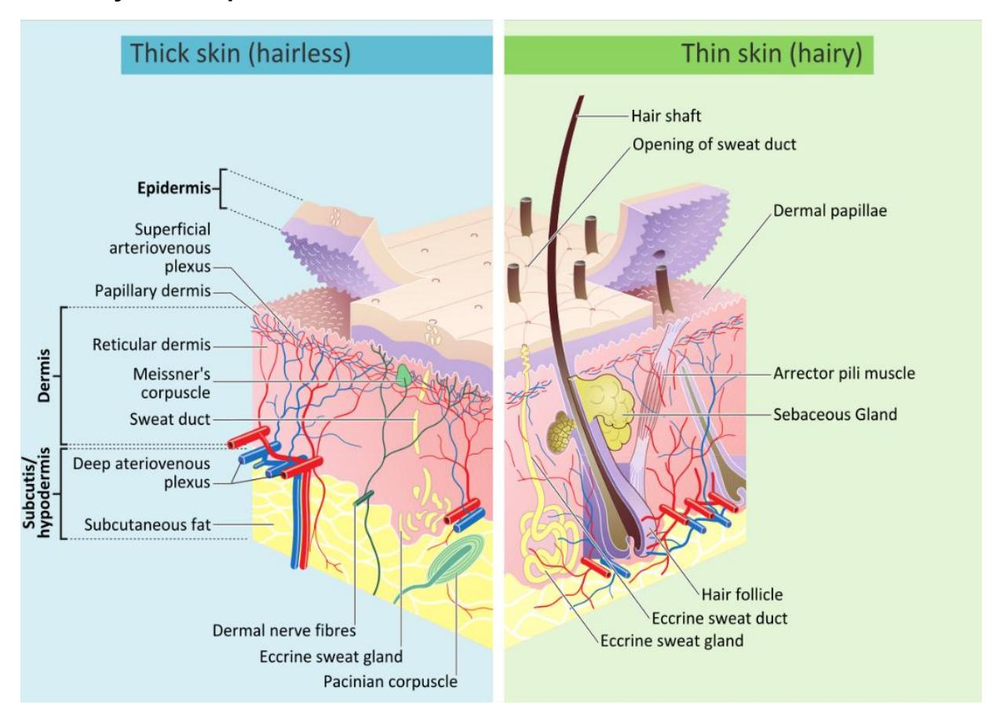
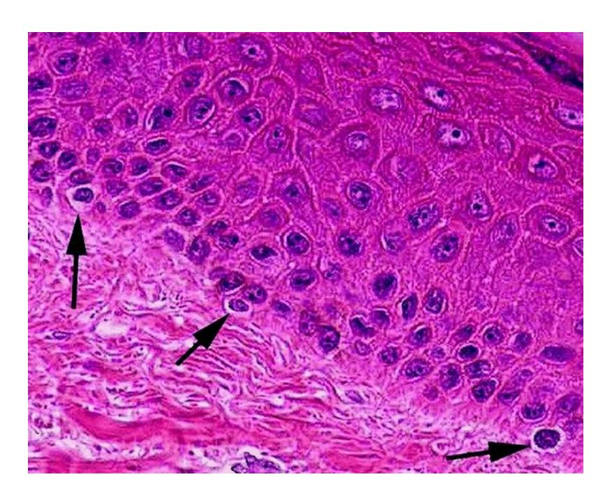
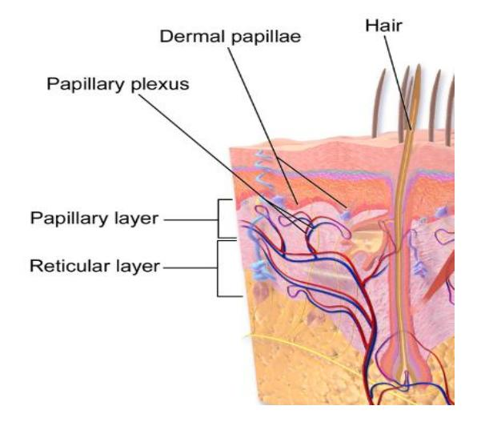

## **Integumentary System**

**Figure 5.1** The Integumentary System.

## **Course Objectives**

At the conclusion of this lab, you should be able to:

-   Describe the structure of the skin.
-   Describe the functions of the integumentary system.
-   Differentiate between the layers of the epidermis.
-   Identify the components of the dermis and their function.
-   Identify the layers of the Integumentary system on a model or a diagram.
    -   Layers and Sublayers of Cutaneous Membrane also be able to identify the epidermal layers on a model or a diagram (note: the layers are listed from superficial to deep)
        -   Stratum corneum
        -   Stratum lucidum thick skin only
        -   Stratum granulosum
        -   Stratum spinosum
        -   Stratum basale (germinitivum)
    -   Dermis
        -   Papillary layer
        -   Reticular layer
    -   Subcutaneous layer (hypodermis)
-   Using a model or diagram identify and describe the function of the following integumentary structures:
    -   Dermal papillae
    -   Hair shaft
    -   Hair root
    -   Hair follicle
    -   Pore
    -   Arrector pili muscle
    -   Sebaceous gland
    -   Merocrine (eccrine) sweat gland.
-   Apocrine sweat gland
-   Free nerve ending
-   Meissner's (tactile) corpuscle
-   Pacinian (pressure) corpuscle
-   Keratinocyte
-   Melanocyte

## **Prelab Activities**

## **Prelab Activity 5.1**

Using your textbook define or identify the following terms.

**Epidermal Layer**

|| Term                              | Definition                                                                                                                             ------------------------------------------------------ |
| **Epidermis**                     | The outermost layer of the skin that provides a protective barrier against the environment.                                                         |
| **Stratum corneum**               | The outermost layer of the epidermis made of dead, flattened keratinized cells that prevent water loss and protect against damage.                  |
| **Stratum lucidum**               | A thin, clear layer found only in thick skin (like palms and soles) that adds extra protection.                                                     |
| **Stratum granulosum**            | A layer where cells begin to die and form keratin, helping create the skin’s waterproof barrier.                                                    |
| **Stratum spinosum**              | A layer of living cells that provides strength and flexibility to the skin through keratin production.                                              |
| **Stratum basale (germinativum)** | The deepest epidermal layer where new skin cells are produced through cell division; contains melanocytes.                                          |
| **Dermal layer (Dermis)**         | The thick layer beneath the epidermis containing blood vessels, nerves, hair follicles, and connective tissue that supports and nourishes the skin. |

**Dermal Layer**

| Term                | Definition                                                      
| ------------------- |
| **Dermis**          | The middle layer of the skin beneath the epidermis that contains connective tissue, blood vessels, nerves, hair follicles, and glands; it provides strength, nourishment, and support to the skin. |
| **Papillary layer** | The upper portion of the dermis made of loose connective tissue; contains capillaries and sensory receptors and forms finger-like projections that interlock with the epidermis.                   |
| **Reticular layer** | The deeper, thicker portion of the dermis made of dense connective tissue; provides strength and elasticity due to collagen and elastin fibers.                                                    |---------------------------------|------------|
| Subcutaneous Layer (Hypodermis) |
| Term                                | Definition
| **Subcutaneous Layer (Hypodermis)** | The deepest layer beneath the dermis made mainly of fat and loose connective tissue; it insulates the body, stores energy, cushions organs, and anchors the skin to underlying structures. |
|

**Integumentary Structures**

| | Term                                | Definition                                                                                                                                                      |
| ----------------------------------- | --------------------------------------------------------------------------------------------------------------------------------------------------------------- |
| **Dermal papillae**                 | Small, finger-like projections of the dermis that extend into the epidermis, increasing surface area for nutrient exchange and helping form fingerprints.       |
| **Hair shaft**                      | The visible portion of hair that extends above the surface of the skin, composed of dead, keratinized cells.                                                    |
| **Hair root**                       | The portion of hair located beneath the skin’s surface within the hair follicle.                                                                                |
| **Hair follicle**                   | A tubular structure in the dermis that surrounds and anchors the hair root; it is responsible for hair growth.                                                  |
| **Pore**                            | The opening of a sweat gland or hair follicle on the skin surface.                                                                                              |
| **Arrector pili muscle**            | A tiny smooth muscle attached to hair follicles that contracts to raise hair (“goosebumps”).                                                                    |
| **Sebaceous gland**                 | Oil-producing gland that secretes sebum to lubricate and waterproof skin and hair.                                                                              |
| **Merocrine (eccrine) sweat gland** | A sweat gland that produces watery sweat for thermoregulation and releases it directly onto the skin surface.                                                   |
| **Apocrine sweat gland**            | A sweat gland located mainly in the armpits and groin that produces thicker sweat activated by stress or hormones; becomes odorous when bacteria break it down. |
| **Free nerve ending**               | Simple sensory receptors that detect pain, temperature, and light touch in the skin.                                                                            |
| **Meissner's (tactile) corpuscle**  | Sensory receptors in the dermis that detect light touch and fine texture.                                                                                       |
| **Pacinian (pressure) corpuscle**   | Deep pressure receptors in the skin that detect vibration and heavy pressure.                                                                                   |
| **Keratinocyte**                    | The most common skin cell in the epidermis that produces keratin for protection and waterproofing.                                                              |
| **Melanocyte**                      | Pigment-producing cell in the epidermis that produces melanin, which gives skin color and protects against UV radiation.                                        |

## **Prelab Activity 5.2**

Using your textbook define or identify the following layers.

**Figure 5.2** The Integumentary System.

### Label the following layers

- **4:** Epidermis  
- **5:** Dermis  
- **6:** Hypodermis (Subcutaneous layer)

### Label the following accessory structures

- **15:** Hair follicle  
- **21:** Pacinian (pressure) corpuscle  
- **14:** Sebaceous gland  
- **20:** Merocrine (eccrine) sweat gland  
## **Lab Activities**

## **Integumentary System**

**Figure 5.3** Photomicrograph of a Section of Thick Skin.

## **General Functions of the Integumentary System**

The Integumentary system functions include but are not limited to the following functions:

-   protection from physical damage or chemical or biological agents,
-   water, and temperature regulation,
-   sensory,
-   synthesis of vitamin D,
-   fat storage.

## **Layers of the Skin and the Hypodermis**

### **Terms**

-   Epidermis
-   Dermis
-   Hypodermis (Subcutaneous)

**Figure 5.4** Diagram of the Integument Layers.

### **Epidermal Layers and their Function**

**Figure 5.5 Layers of the Epidermis**

**Table 5.1 Epidermal Layers (Listed Superficial to Deep)**
| Epidermal Layer               | Major Features |
|-------------------------------|----------------|
| Stratum corneum               | Outermost layer; composed of dead, flattened keratinized cells; provides protection and prevents water loss |
| Stratum lucidum               | Thin, clear layer of dead cells found only in thick skin (palms and soles); provides extra protection |
| Stratum granulosum            | Keratinization occurs; cells flatten, accumulate keratin granules, and begin to die |
| Stratum spinosum              | Living keratinocytes connected by desmosomes; provides strength and flexibility |
| Stratum basale (germinitivum) | Deepest epidermal layer; single layer of actively dividing cells; contains melanocytes |

## **Lab Activities**

## **Lab Activity 5.1**

## **Anatomy of the Integumentary System**

-   Obtain a model of Hubbard TM Scientific or a 3D model of the integumentary system.
-   Take a picture of one of the models of the integumentary system available in the lab with your cell phone. Label and identify the epidermis, dermis, and the hypodermis.
-   Set up a microscope with a slide of the skin. Focus on the integument and take a picture (photomicrograph) of the slide with your cellphone. Identify the epidermis, dermis, and the hypodermis.
    -   Epidermis.
        -   Identify the type of cells that comprise this layer.
        -   Determine if there are blood vessels in this layer.
        -   Label the apical and basal surfaces of this layer.
    -   Dermis
        -   Notice that the interface between the dermal and epidermal layers is uneven. The projections are called dermal papillae. Find this interface on the model before you and label them.
        -   Do the same for these structures in your picture.

## **Anatomy of the Epidermis**

**Figure 5.6 Layers of the Integumentary system. Comparison of the structure of thick skin vs thin skin.**

### **Lab Activity 5.1:**

## **The Anatomy of the Integumentary System continued**

-   Compare the thick and thin skin models, or pictures, of the skin.
    -   What differences do you note in their appearance and structure?
    -   Where is each type located on the body? From this observation provide an explanation of each skin type's function.
    -   Identify and describe the layers of each type of skin.
-   Find a picture of the epidermis on the internet and print the picture.
    -   Label all of the layers of the epidermis
    -   Provide a description of each layer of the epidermis on the table below.

**Table 5.2 Epidermal layers listed superficial to deep.**
| Epidermal Layer    | Description |
|--------------------|-------------|
| Stratum corneum    | The outermost layer of the epidermis composed of multiple layers of dead, flattened, keratinized cells that form a tough protective barrier and prevent water loss |
| Stratum lucidum    | A thin, clear layer of dead keratinocytes found only in thick skin such as the palms of the hands and soles of the feet |
| Stratum granulosum | A layer where keratinocytes accumulate keratin granules, cells flatten, and programmed cell death begins |
| Stratum spinosum   | A layer of living keratinocytes connected by desmosomes, providing strength and flexibility to the skin |
| Stratum basale     | The deepest epidermal layer consisting of a single row of actively dividing cells; contains melanocytes and stem cells |

### **Lab Activity 5.2:**

## **Dermis**

-   Using one of the lab models, with the assistance of the picture below, locate the two layers of the dermis.
    -   Locate the papillary ridge.
    -   Identify the type of connective tissue in each layer.

**Figure 5.7** Epidermis, Papillary Dermis and Reticular Dermis.

## **Lab Activity 5.3:**

-   Using a model, with the assistance of the following diagram, identify and describe the function of the following integumentary structures.
-   Identify and label the structures indicated below.
-   Have your instructor check your work.
-   Take a picture to use as a study guide.

## **Dermal Structures**

-   Dermal papillae
-   Hair shaft
-   Hair root
-   Hair follicle
-   Pore
-   Arrector pili muscle
-   Sebaceous gland
-   Merocrine (eccrine) sweat gland.
-   Apocrine sweat gland
-   Free nerve ending
-   Meissner's (tactile) corpuscle
-   Pacinian (pressure) corpuscle
-   Keratinocyte
-   Melanocyte

**Figure 5.8** Anatomy of Human Skin.

## **Lab Activity 5.4:**

Describe the function of each of the listed dermal structures.

## Table 5.3 — Dermal Structures and Their Functions

| Dermal Structure                | Function(s) |
|---------------------------------|-------------|
| Dermal papillae                 | Increase the surface area between the dermis and epidermis; contain capillaries that supply nutrients to the epidermis and contribute to fingerprint formation |
| Pore                            | An opening in the skin that allows sweat or sebum to reach the skin surface |
| Arrector pili muscle            | Smooth muscle that contracts to raise the hair shaft, producing goosebumps and helping conserve heat |
| Sebaceous gland                 | Produces sebum to lubricate, waterproof, and protect the skin and hair |
| Merocrine (eccrine) sweat gland | Produces watery sweat that helps regulate body temperature through evaporation |
| Apocrine sweat gland            | Produces a thicker secretion associated with scent; activated during stress and puberty |
| Free nerve ending               | Detects pain, temperature, and crude touch sensations |
| Meissner's (tactile) corpuscle  | Sensory receptor that detects light touch and fine tactile discrimination |
| Pacinian (pressure) corpuscle   | Sensory receptor that detects deep pressure and vibration |
| Keratinocyte                    | Produces keratin, which provides strength, protection, and waterproofing to the skin |
| Melanocyte                      | Produces melanin, which gives skin its pigment and protects cells from ultraviolet (UV) radiation |

## **Epidermis**

The epidermis consists of stratified epithelial tissue which is primarily composed of keratinocytes. Keratinocytes produce the protein keratin which waterproofs the cells as well as provides additional strength and protection. Other cells found within this layer are the melanocytes, which produce the pigment melanin and the Langerhans cells that provide an immune function.

**Figure 5.9** Structure of the Epidermis.

Epidermal Layers: the layers or strata progression from the superficial to the deep layers.

## **Characteristics of this Layer:**

-   Mostly keratinocytes
-   reproductive actively mitotic division
-   produce keratin with cell progression upward keratinization.

### **Strata of the Epidermis:**

-   superficial stratum stratum corneum
-   intermediate stratum
    -   stratum lucidum absent in "thin" skin.
    -   stratum granulosum
    -   stratum spinosum
-   bottom stratum stratum basale (germinitivum)

## **Skin Pigmentation**

Melanocytes. Melanocytes are located in the stratum basale as can be noted in Figures 5.10 & 5.11.

**Figure 5.10** Epidermis with Melanocyte.

**Figure 5.11** Examples of Melanocytes in the Basal Layer of the Epidermis.

## **Dermal and Subcutaneous Layers**

## **Layers of the Dermis**

-   Papillary layer
-   Reticular layer

**Figure 5.12** Layers of the dermis.

## **Hypodermis (Subcutaneous)**

**Figure 5.13** Anatomy of the Skin.

## **Dermal and Hypodermal Structures**

Using a model or diagram of the integumentary system, identify and describe the function of the following integumentary structures:

-   Dermal papillae
-   Hair shaft
-   Hair root
-   Hair follicle
-   Pore
-   Arrector pili muscle

**Figure 5.14.**

**Figure 5.14** Hair Follicle.

## **Post Lab Activities**

## **Test your recall:**

## **Post Lab Activity 5.1: Answer the concept questions**

## Post Lab Activity 5.1 — Concept Questions

### Name the layers of the dermis

- Papillary layer  
- Reticular layer  

---

### List three major types of glands associated with the integumentary system and describe their function

- **Sebaceous glands:** Secrete sebum (oil) that lubricates and waterproofs the skin and hair  
- **Merocrine (eccrine) sweat glands:** Produce watery sweat that helps regulate body temperature through evaporation  
- **Apocrine sweat glands:** Produce a thicker secretion involved in scent; become active during puberty and emotional stress  

---

### What are the three protective functions of the integumentary system?

- Provides a physical barrier against injury, pathogens, and chemicals  
- Protects the body from ultraviolet (UV) radiation  
- Prevents excessive water loss (dehydration)  
## **Post Lab Activity 5.2**

## **Matching**

## Table 5.4 — Matching (Completed)

| #  | Term                  | Correct Letter |
|----|-----------------------|----------------|
| 1  | Pore                  | e |
| 2  | Arrector pili muscle  | h |
| 3  | Meissner's corpuscle  | g |
| 4  | Pacinian corpuscle    | b |
| 5  | Keratinocyte          | k |
| 6  | Apocrine sweat gland  | i |
| 7  | Hair follicle         | d |
| 8  | Dermal papillae       | m |
| 9  | Merocrine sweat gland | l |
| 10 | Hair root             | f |
| 11 | Sebaceous gland       | c |
| 12 | Free nerve ending     | j |
| 13 | Hair shaft            | a |

---

## Table 5.5 — Identification of the Dermal Structures

images/_page_115_Picture_3.jpeg

**Figure 5.15** Anatomy of Human Skin (Sans Labels)

| Dermal Structure      | Number on Figure 5.15 |
|-----------------------|-----------------------|
| Pore                  | 2 |
| Arrector pili muscle  | 8 |
| Meissner's corpuscle  | 9 |
| Pacinian corpuscle    | 14 |
| Keratinocyte          | 3 |
| Apocrine sweat gland  | 13 |
| Hair follicle         | 6 |
| Dermal papillae       | 15 |
| Merocrine sweat gland | 11 |
| Hair root             | 12 |
| Sebaceous gland       | 7 |
| Free nerve ending     | 10 |
| Hair shaft            | 1 |

**Figure 5.15** Anatomy of Human Skin Sans Labels.

## Table 5.6 — Match the Statement With the Best Answer (Completed)

| Answer | Statement | Filled Answer |
|-------|--------------------------------------|-----------------------------|
| a. | The epidermis is composed of  | **stratified squamous epithelial tissue** |
| b. | The deepest layer of the epidermis. | **stratum basale** |
| c. | The majority of the cells of the epidermis are , so‑called because they make  | **keratinocytes; keratin** |
| d. | Melanocytes are located in the (which layer?). | **stratum basale** |
| e. | Immune cells in the stratum spinosum which protect against invaders are the  | **Langerhans’ cells** |
| f. | A very thin layer called the  is in the epidermis but is visible only in thick skin. | **stratum lucidum** |
| g. | The first level of protection against abrasion and toxic chemicals at the body's surface is provided by the  | **stratum corneum** |
| h. | The dermis consists of two layers: the , which is characterized by a dimpled interface with the epidermis, and the , which accounts for 80% of the skin's thickness. | **papillary layer; reticular layer** |
| i. | The reticular layer of the dermis contains  to sense firm pressure. | **Pacinian corpuscles** |
| j. | Apocrine and eccrine glands are both  (sweat) glands. | **sudoriferous** |
| k. |  glands produce a waxy substance to protect the ear canal from dust, small insects, etc. | **ceruminous** |
| l. | The portion of the hair that is above the surface of the skin is called the  | **hair shaft** |
| m. | The sub‑surface portion of the hair is called the  | **hair root** |
| n. | The origin of the hair shaft, deep within the dermis, is called the  | **hair bulb** |
| o. | The sheath in which a hair is held is called the  | **hair follicle** |

## **Post Lab Activity 5.3**

**Crossword Puzzle:** Complete the following crossword puzzle.

**Figure 5.16 The Integumentary System**

## Post Lab Activity 5.3 — Crossword Puzzle (Solved)

### Across

**7.** The layer which serves to strengthen the skin and provides elasticity.  
It contains hair follicles, sweat glands, and sebaceous glands. *(9,5)*  

**R E T I C U L A R   L A Y E R**  
**Answer:** Reticular layer  

---

**8.** A thin layer of cells in the epidermis lying above the stratum spinosum and below the stratum corneum. *(7,10)*  

**S T R A T U M   G R A N U L O S U M**  
**Answer:** Stratum granulosum  

---

**9.** The outermost of the three layers that comprise the skin. *(9)*  

**E P I D E R M I S**  
**Answer:** Epidermis  

---

### Down

**1.** The outermost layer of the epidermis comprised of several levels of flattened corneocytes. *(7,7)*  

**S T R A T U M   C O R N E U M**  
**Answer:** Stratum corneum  

---

**2.** A more superficial and significantly thinner layer of the dermis, mainly composed of areolar connective tissue. *(9,5)*  

**P A P I L L A R Y   L A Y E R**  
**Answer:** Papillary layer  

---

**3.** The lowermost layer of the integumentary system in vertebrates. *(10)*  

**H Y P O D E R M I S**  
**Answer:** Hypodermis  

---

**4.** A layer of the epidermis composed of polyhedral keratinocytes. *(7,8)*  

**S T R A T U M   S P I N O S U M**  
**Answer:** Stratum spinosum  

---

**5.** The deepest layer of the five layers of the epidermis; a single layer of columnar or cuboidal basal cells. *(7,6)*  

**S T R A T U M   B A S A L E**  
**Answer:** Stratum basale  

---

**6.** A thin, clear layer of dead skin cells visible only in thick skin. *(7,7)*  

**S T R A T U M   L U C I D U M**  
**Answer:** Stratum lucidum  

## **Post Lab Activity 5.4**
## Check Your Understanding

### Autopsy and layers of the integument

From the superficial to the deepest layer, the medical examiner would cut through the following layers of the integumentary system:

- Epidermis  
- Dermis  
- Hypodermis (subcutaneous layer)  

---

### Explanation of the infant’s skin discoloration

The general practitioner is not concerned because the yellowish‑orange tint of the child’s skin is caused by excess **beta‑carotene** from consuming large amounts of carotene‑rich foods such as carrots, squash, sweet potatoes, and broccoli. Beta‑carotene is a pigment that accumulates in the **stratum corneum** of the epidermis, a condition known as **carotenemia**. This condition is harmless, temporary, and resolves once the diet is diversified. It does not affect organ function and does not indicate liver disease or jaundice.

---

### Regulation of body temperature by the integumentary system

When body temperature rises above normal, the integumentary system helps regulate temperature through **vasodilation and sweating**. Blood vessels in the dermis dilate, increasing blood flow to the skin surface and allowing excess heat to dissipate into the environment. At the same time, **merocrine (eccrine) sweat glands** release sweat onto the skin surface. As the sweat evaporates, it removes heat from the body, effectively lowering body temperature.

---

### Susceptibility of light‑skinned individuals to malignant melanoma

Light‑skinned individuals are more susceptible to malignant melanoma because they have lower levels of **melanin**, the pigment produced by melanocytes that protects the skin from ultraviolet (UV) radiation. Melanin absorbs and disperses UV radiation, reducing DNA damage in skin cells. With less melanin present, UV radiation can more easily damage cellular DNA, increasing the risk of mutations that may lead to skin cancers such as malignant melanoma.
``
## **Post Lab Activity 5.5**

## **Test Your Recall**

Label the layers and structures of the epidermis.

**Figure 5.17** Layers of the Epidermis.

Using the picture below, identify the substructures within the following accessory structures.

-   Hair shaft
-   Hair root
-   Hair bulb
-   Hair follicle
-   Arrector pili muscle
-   Sebaceous gland
-   Apocrine sweat gland

**Figure 5.18** Illustration from Anatomy & Physiology of the Epidermis**.**
## Post Lab Activity 5.6

## Fill in the Blanks

### Name the layers of the dermis

- Papillary layer  
- Reticular layer  

---

### List three major types of glands associated with the integumentary system and describe their function

|   | Answer |
|---|--------|
| a) | **Sebaceous glands** – produce sebum to lubricate and waterproof the skin and hair |
| b) | **Merocrine (eccrine) sweat glands** – produce watery sweat for thermoregulation |
| c) | **Apocrine sweat glands** – produce thicker secretions associated with body scent |

---

### What are the three protective functions of the integumentary system?

|   | Answer |
|---|--------|
| a) | Provides a physical barrier against injury and pathogens |
| b) | Protects against ultraviolet (UV) radiation |
| c) | Prevents excessive water loss (dehydration) |

---

### List four functions of the integumentary system

|   | Answer |
|---|--------|
| a) | Protection |
| b) | Temperature regulation |
| c) | Sensation |
| d) | Vitamin D synthesis |

---

### The skin is composed of what type of epithelial tissue?

- **Stratified squamous epithelium**

---

### 1) List the five layers of the epidermis found in thick skin  
*(Indicate which layer is not present in thin skin)*

|   | Answer |
|---|--------|
| a) | Stratum corneum |
| b) | Stratum lucidum **(not present in thin skin)** |
| c) | Stratum granulosum |
| d) | Stratum spinosum |
| e) | Stratum basale |

---

### 2) Identify four accessory structures found in the dermis and describe their function

|   | Answer |
|---|--------|
| a) | **Hair follicle** – produces and anchors hair |
| b) | **Sebaceous gland** – secretes oil to lubricate skin and hair |
| c) | **Sweat glands** – produce sweat for cooling |
| d) | **Sensory receptors** – detect touch, pressure, pain, and temperature |
## **Answer keys**

#### **Crossword Puzzle**

**Across: 7** Reticular layer, **8** Stratum granulosum, **9** Epidermis.

**Down: 1** Stratum corneum, **2** Papillary layer, **3** Hypodermis, **4** Stratum spinosum, **5** Stratum basale, **6** Stratum lucidum.

**Chapter 5: Integumentary System**

| Key Terms | Definitions |
|----------------------|-------------------------------------------------|
| acne | skin condition due to infected sebaceous glands |
| albinism | genetic disorder that affects the skin, in which there is no melanin production |
| apocrine sweat gland | sweat gland that is armpits and genital regions |
| arrector pili | smooth muscle that is activated in response to external stimuli that pull on hair follicles and make the hair "stand-up" |
| basal cell | type of stem cell found in the stratum basale and in the hair matrix that continually undergoes cell division, producing the keratinocytes of the epidermis |
| basal cell carcinoma | cancer that originates from basal cells in the epidermis of the skin |
| bedsore | sore on the skin that develops when regions of the body start necrotizing due to constant pressure and lack of blood supply; also called decubitus ulcers |
| callus | thickened area of skin that arises due to constant abrasion |
| corn | type of callus that is named for its shape and the elliptical motion of the abrasive force |
| cortex | in hair, the second or middle layer of keratinocytes originating from the hair matrix, as seen in a cross-section of the hair bulb |
| cuticle | in hair, the outermost layer of keratinocytes originating from the hair matrix, as seen in a cross section of the hair bulb |
| dermal papilla (plural = dermal papillae) | extension of the papillary layer of the dermis that increases surface contact between the epidermis and dermis |
| dermis | layer of skin between the epidermis and hypodermis, composed mainly of connective tissue and containing blood vessels, hair follicles, sweat glands, and other structures |
| desmosome | structure that forms an impermeable junction between cells |
| eccrine sweat gland | sweat gland that is common throughout the skin surface; it produces a hypotonic sweat for thermoregulation |
| eczema | skin condition due to an allergic reaction, which resembles a rash |
| elastin fibers | fibers made of the protein elastin that increase the elasticity of the dermis |
| epidermis | outermost tissue layer of the skin |
| external root | outer layer of the hair follicle that is an extension of the epidermis, which |
| sheath | encloses the hair root |
| first-degree burn | superficial burn that injures only the epidermis |
| fourth-degree burn | burn in which full thickness of the skin and underlying muscle and bone is damaged |
| free nerve ending | a.k.a. bare nerve ending, is an unspecialized, afferent nerve fiber sending its signal to a sensory neuron. |
| hair | keratinous filament growing out of the epidermis |
| hair bulb | structure at the base of the hair root that surrounds the dermal papilla |
| hair follicle | cavity or sac from which hair originates |
| hair matrix | layer of basal cells from which a strand of hair grows |
| hair papilla | mass of connective tissue, blood capillaries, and nerve endings at the base of the hair follicle |
| hair root | part of hair that is below the epidermis anchored to the follicle |
| hair shaft | part of hair that is above the epidermis but is not anchored to the follicle |
| hypodermis | connective tissue connecting the integument to the underlying bone and muscle |
| hyponychium | thickened layer of stratum corneum that lies below the free edge of the nail |
| integumentary system | skin and its accessory structures |
| internal root sheath | innermost layer of keratinocytes in the hair follicle that surround the hair root up to the hair shaft |
| keloid scar | scar that has layers raised above the skin surface |
| keratin | structural protein that gives skin, hair, and nails its hard, water-resistant properties |
| keratinocyte | cell that produces keratin and is the most predominant type of cell found in the epidermis |
| Langerhans cell | specialized dendritic cell found in the stratum spinosum that functions as a macrophage |
| lunula layer of thick epithelium | basal part of the nail body that consists of a crescent-shaped layer of thick epithelium |
| medulla | in hair, the innermost layer of keratinocytes originating from the hair matrix |
| Meissner corpuscle (also, tactile corpuscle) | in the skin that responds to light touch |
| melanin | pigment that determines the color of hair and skin |
| melanocyte | cell found in the stratum basale of the epidermis that produces the pigment melanin |
| melanoma | type of skin cancer that originates from the melanocytes of the skin |
| melanosome | intercellular vesicle that transfers melanin from melanocytes into keratinocytes of the epidermis |
| merocrine gland | See eccrine gland |
| Merkel cell | receptor cell in the stratum basale of the epidermis that responds to the sense of touch |
| metastasis | spread of cancer cells from a source to other parts of the body |
| nail bed | layer of epidermis upon which the nail body forms |
| nail body | main keratinous plate that forms the nail |
| nail cuticle | fold of epithelium that extends over the nail bed, also called the eponychium |
| nail fold | fold of epithelium at that extend over the sides of the nail body, holding it in place nail root part of the nail that is lodged deep in the epidermis from which the nail grows |
| Pacinian corpuscle (also, lamellated corpuscle) | receptor in the skin that responds to vibration |
| papillary layer | superficial layer of the dermis, made of loose, areolar connective tissue |
| reticular layer | deeper layer of the dermis; it has a reticulated appearance due to the presence of abundant collagen and elastin fibers |
| rickets | disease in children caused by vitamin D deficiency, which leads to the weakening of bones |
| scar | collagen-rich skin formed after the process of wound healing that is different from normal skin |
| sebaceous gland | type of oil gland found in the dermis all over the body and helps to lubricate and waterproof the skin and hair by secreting sebum |
| sebum | oily substance that is composed of a mixture of lipids that lubricates the skin and hair |
| second-degree burn | partial thickness burn that injures the epidermis and a portion of the dermis |
| squamous cell | type of skin cancer that originates from the stratum spinosum of the |
| carcinoma | epidermis |
| stratum basale | deepest layer of the epidermis, made of epidermal stem cells |
| stratum corneum | most superficial layer of the epidermis |
| stratum granulosum | layer of the epidermis superficial to the stratum spinosum |
| stratum lucidum | layer of the epidermis between the stratum granulosum and stratum corneum, found only in thick skin covering the palms, soles of the feet, and digits |
| stratum spinosum | layer of the epidermis superficial to the stratum basale, characterized by the presence of desmosomes |
| sudoriferous gland | sweat gland |
| third-degree burn | burn that penetrates and destroys the full thickness of the skin (epidermis and dermis) |
| vitamin D | compound that aids absorption of calcium and phosphates in the intestine to improve bone health |
| vitiligo | skin condition in which melanocytes in certain areas lose the ability to produce melanin, possibly due an autoimmune reaction that leads to loss of color in patches |
